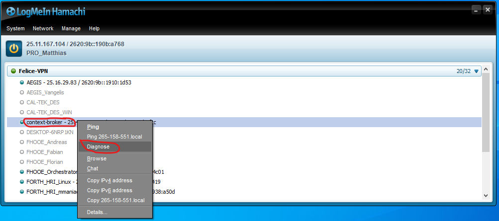
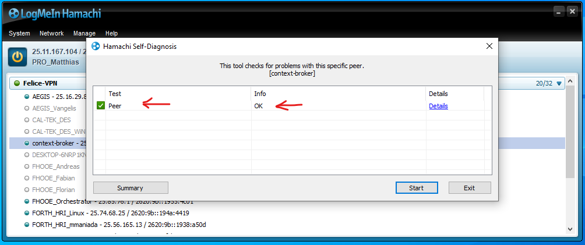
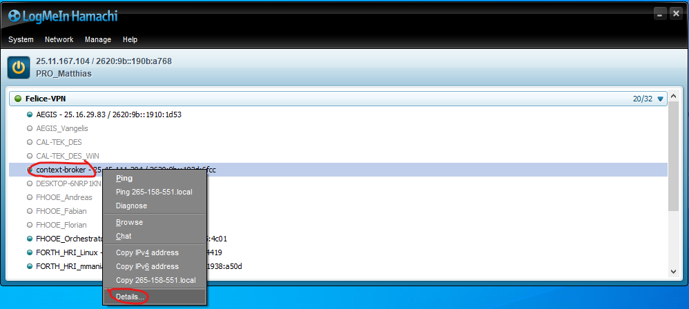
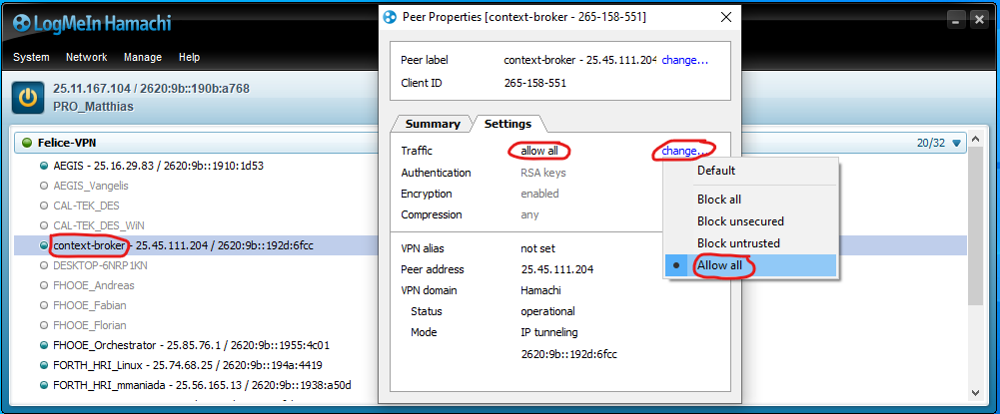

# ros1_firos

This project is a fork of iml130/firos (https://github.com/iml130/firos) with adaptations to conform with FELICE requirements ==> expressions of entity types and ids of the entities

### Changed features w.r.t. original version iml130/firos
**Allow dots instead of slashes in FIWARE Entity IDs**
- FIROS tries to directly relate the considered topic-string of ROS-side to the Entity-ID of FIWARE. ROS topic-strings usually only contain slashes as separators "/".

### Firewall and networking setup when using FIROS in WSL (Windows Subsystem for Linux)
**Situation:** 
- By default, any **external / incoming** network traffic is **not forwarded** by Windows into the WSL instance. 
- Communication from WSL to outside is fully enabled.
- Upon restart of the Windows host system, **the WSL instance is assigned with a new IP-Address**.

**Solution:**
- Manually allow incoming and outgoing traffic from / to contextBroker (IP address scope) on Windows host firewall
  - Get IP Addresses of ContextBroker (remote) and Windows host. If located in a VPN get the IP address that was assigned to the Windows host when connecting to the VPN.
  - Open Windows Defender Firewall and click "Advanced Settings" (will ask for administrator rights)
  - Add new **inbound**-rule of type "Scope"
    - Add ContextBroker IP-Address as "remote" IP
    - Add VPN assigned Windows host address as local IP (destination)
    - Add Profactor Windows host address as local IP (destination)
  - Add new **outbound**-rule of type "Scope"
    - Add ContextBroker IP-Address as "remote" IP (destination)
    - Add VPN assigned Windows host address as local IP
    - Add Profactor Windows host address as local IP

- If connected via VPN to external ContextBroker: Check if Communication ContextBroker and Windows Host is working now
  - Open LogMeIn Hamachi VPN client
  - Connect to FELICE network - You should then see all available hosts in the FELICE net, including the 'context-broker'
  - Perform a 'connection diagnose' test
    - Right-click on 'context-broker' host ==> Diagnose; see image below
  
    - In the next popup a positive 'OK' status should be displayed. Note: It could also be the case that 'context-broker' PC is in sleep mode! In this case the 'Details' subpage will indicate 'Connection Timeout' for both directions.
  
  - In case the diagnose test has failed - check if the traffic is allowed by the VPN client
    - Right-click on 'context-broker' host ==> Details; see image below
  
    - Allow all traffic to and from
  

  - If the 'connection diagnose' test fails with 'Connection Timeout' for both directions, the 'context-broker' PC is in sleep mode
    - Open the [context-broker Entities URL](http://25.45.111.204:1026/v2/entities) a few times (using your default browser) and it will wake up!

- Manually activate port forwarding of needed ports into WSL instance
  - Open **WSL console** and type "ip address"
  - Mark and copy the IP address of the "eth0" interface
  - Open **Windows host Powershell console** and navigate to script [network_setting_felice_manual.ps1](https://gitlab.profactor.at/felice_eu/ros1_firos/-/blob/main/doc/utils/network_setting_felice_manual.ps1)
  - Edit the script:
    - in line 7, set the retrieved IP address in the assignment statement `$remoteport = "172.29.252.158"`
    - in line 9, add all ports that need to be forwarded to WSL `$ports = @(5050, 1026, 10100);`
  - **Run the script in the Windows Powershell console** (will ask for administrator rights)
  - Check status of port forwarding by executing `netsh interface portproxy show v4tov4`

- **Alternative to manual activation of port forwarding**:
  - Dependent on the installation of WSL, also the fully automated script might work
  - This one is located [here](https://gitlab.profactor.at/felice_eu/ros1_firos/-/blob/main/doc/utils/network_setting_felice.ps1)
  - Just run it in Powershell (will ask for administrator rights). If not working, go for the 'manual way'
  - In case the script did not complain: Check status of port forwarding by executing `netsh interface portproxy show v4tov4`

Now the external ContextBroker should be able to able to reach a running WLS FIROS instance and vice-versa.

### Perform a FIROS integration test with the remote ContextBroker
This section describes a simple integration test with ROS modules, FIROS and the remote FIWARE ContextBroker.
- Install ROS-Noetic in WSL
- Create a catkin-workspace
- Clone the projects as follows, and ensure to navigate into `catkin_ws/src/` first.
  - `git clone --recursive https://gitlab.profactor.at/felice_eu/ros1_firos firos` (please make sure that all submodules are cloned properly)
  - `git clone https://gitlab.profactor.at/felice_eu/ros1_felice_robot_execution_module felice_robot_execution_module`
  - `git clone https://gitlab.profactor.at/felice_eu/ros1_felice_ros_msgs felice_ros_msgs`
- Navigate to `catkin_ws/`
- Build the workspace by running `catkin_make`, but ensure to have the ROS installation 'sourced' if that is not yet done automatically using `.bashrc`

- The folder `/home/<wsl_user>/catkin_ws/src/felice_robot_execution_module/firos_config/` contains the firos-config files that are relevant for the **felice_robot_execution_module**. The most important files are `config.json` and `topics.json`
  - In `config.json` make sure to set the **contextbroker IP address** to the address of the context-broker PC within the FELICE VPN (most likely: 25.45.111.204), and the **endpoint IP address** to the IP your host was assigned within the FELICE VPN (this will specific for your installation)
  - In `topics.json` the outline of each topic configuration is as follows: `"/ROS/Topic/topicBla" : ["ros_message_type", <subscriber/publisher>, <GUID or manual id-postfix / ALL_OF_BASE_ID or regular expression string>]`
    - The "/ROS/Topic/topicBla" describes the used topic within ROS. **Note** that for the FIWARE entity-id this topic string will be used as a basis: all `/`es except the first one will be converted to dots.
    - The "ros_message_type" denotes the message type on ROS-side that will be used. On the FIWARE side, the message structure serves as basis for automatically constructing the FIWARE requests / contents (i.e. the JSON object on FIWARE side).
    - "subscriber" means that the FIROS module subscribes to all messages arriving at the mentioned topic on ROS-side, AND publishes them to FIWARE. If "GUID" is mentioned as a third parameter, a HEX GUID will be generated and appended to the entity-id on FIWARE side. If anything other than "GUID" is provided, exactly this string will be appended.
    - "publisher" means that the FIROS module subscribes to entity changes on FIWARE side, AND publishes them to the mentioned topic on ROS side. If "ALL_OF_BASE_ID" ist provided as third parameter, all entities having the base id (derived from the topic string) will be subscribed to. Alternatively a **regular expression** string can be provided for the subscription.

- create a few consoles and run the ros nodes as follows
  - `roscore`
  - `rosrun felice_robot_execution_module pub_test_system_health`
  - `rosrun firos core.py --conf /home/<wsl_user>/catkin_ws/src/felice_robot_execution_module/firos_config/`
  - the last node should run firos and will then publish the SystemHealth message entity to the ContextBroker. It will also create a subscription (just for testing) but as of current, nothing is received as noone is sending something at the other end.
  - You chan check the published entities on FIWARE side using the [entities-URL](http://25.45.111.204:1026/v2/entities). Subscriptions on FIWARE side are viewed using the [subscriptions-URL](http://25.45.111.204:1026/v2/subscriptions).
  - On ROS side you can use `rostopic pub` and `rostopic echo` as usual.

